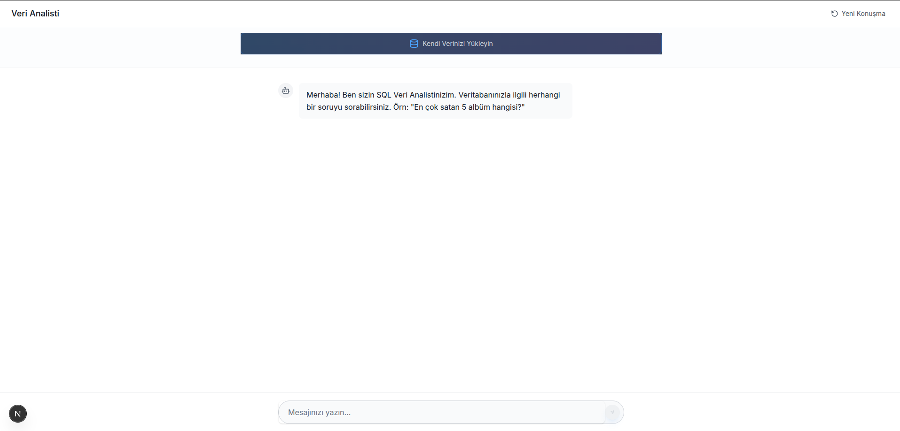
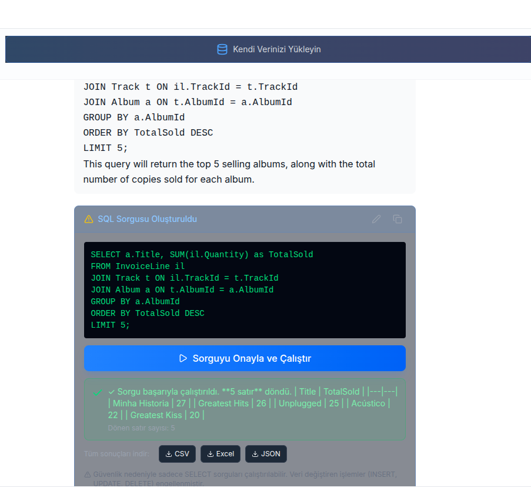
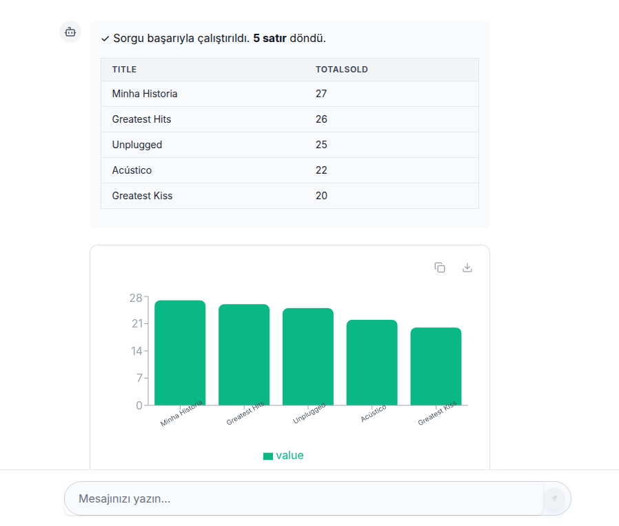
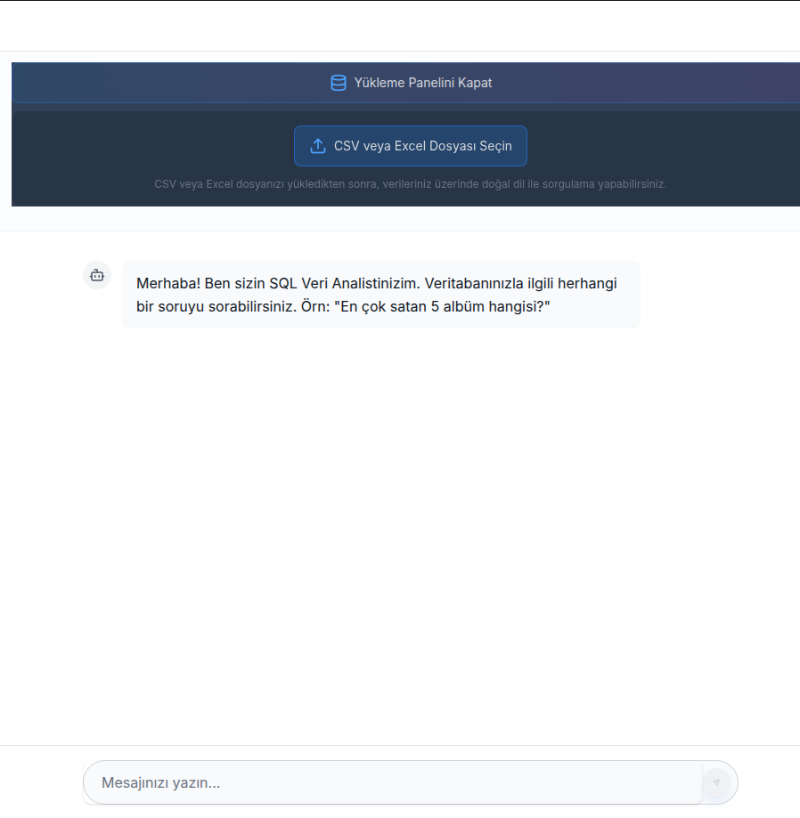

# SQL Veri Analisti - Text-to-SQL AI Asistanı

Modern, kullanıcı dostu bir SQL veri analisti asistanı. Doğal dil ile veritabanı sorguları oluşturun ve sonuçları görselleştirin.

## 🎯 Özellikler

- **Doğal Dil Sorguları**: Türkçe sorularınızı SQL sorgularına dönüştürür
- **Görselleştirme**: Sorgu sonuçlarını grafiklerle görselleştirin
- **Veri Yükleme**: Kendi CSV/Excel dosyalarınızı yükleyin
- **Güvenli SQL**: Sadece SELECT sorgularına izin verilir
- **ChatGPT Tarzı Arayüz**: Modern, sade ve kullanıcı odaklı tasarım

## 📸 Ekran Görüntüleri

### Ana Ekran


### Sorgu Sonuçları


### Grafik Görselleştirme


### Veri Yükleme


## 🚀 Kurulum

### 1. Backend Kurulumu

```bash
cd backend
pip install -r requirements.txt
```

### 2. LLM Model Yapılandırması

Uygulama iki farklı LLM backend'i destekler: **Ollama** (yerel, ücretsiz) ve **Google Gemini** (bulut, API anahtarı gerekir).

#### Ollama Kullanımı (Önerilen - Yerel ve Ücretsiz)

1. **Ollama'yı yükleyin:**
   ```bash
   # Linux/Mac
   curl -fsSL https://ollama.com/install.sh | sh
   
   # veya https://ollama.com/download adresinden indirin
   ```

2. **Ollama servisini başlatın:**
   ```bash
   ollama serve
   ```

3. **İstediğiniz modeli indirin:**
   ```bash
   # Popüler modeller:
   ollama pull llama3.1:8b        # Hızlı ve hafif (önerilen)
   ollama pull llama3.1:70b       # Daha güçlü ama yavaş
   ollama pull mistral:7b         # Alternatif
   ollama pull qwen2.5:7b         # Alternatif
   ```

4. **`.env` dosyasını yapılandırın:**
   ```bash
   cd backend
   cp .env.example .env
   ```
   
   `.env` dosyasında:
   ```env
   LLM_BACKEND=ollama
   OLLAMA_BASE_URL=http://localhost:11434
   OLLAMA_MODEL=llama3.1:8b
   OLLAMA_EMBEDDING_MODEL=nomic-embed-text
   ```

#### Google Gemini Kullanımı

1. **Google AI Studio'dan API anahtarı alın:**
   - https://aistudio.google.com/app/apikey adresine gidin
   - Google hesabınızla giriş yapın
   - "Create API Key" butonuna tıklayın
   - API anahtarınızı kopyalayın

2. **`.env` dosyasını yapılandırın:**
   ```bash
   cd backend
   cp .env.example .env
   ```
   
   `.env` dosyasında:
   ```env
   LLM_BACKEND=gemini
   GOOGLE_API_KEY=your-google-api-key-here
   ```

### 3. Memory Backend Yapılandırması

**Redis Kullanımı (Önerilen):**
```bash
# Docker ile Redis başlatma
docker run -d -p 6379:6379 redis:alpine

# veya sistem Redis servisi
sudo systemctl start redis
```

`.env` dosyasında:
```env
MEMORY_BACKEND=redis
REDIS_HOST=localhost
REDIS_PORT=6379
```

**In-Memory Kullanımı (Geliştirme için):**
```env
MEMORY_BACKEND=in-memory
```

### 4. Backend'i Başlatın

```bash
cd backend
uvicorn app.main:app --reload
```

Backend `http://localhost:8000` adresinde çalışacak.

### 5. Frontend Kurulumu

```bash
cd frontend
npm install
npm run dev
```

Frontend `http://localhost:3000` adresinde çalışacak.

## 📖 Kullanım

1. Backend ve frontend'i başlatın (yukarıdaki kurulum adımlarını takip edin)
2. İsteğe bağlı olarak kendi CSV/Excel veritabanınızı yükleyin
3. Doğal dilde sorularınızı sorun (örn: "En çok satan 5 albüm hangisi?")
4. AI SQL sorgusu önerecek, onayladıktan sonra sonuçları görüntüleyin
5. Sonuçları CSV/Excel/JSON olarak indirin

## ⚙️ Yapılandırma Detayları

### Model Seçimi: Ollama vs Gemini

#### Ollama (Önerilen - Yerel ve Ücretsiz)
- ✅ **Avantajlar:**
  - Tamamen ücretsiz
  - Verileriniz yerelde kalır (gizlilik)
  - İnternet bağlantısı gerektirmez
  - Sınırsız kullanım
  
- ⚠️ **Dezavantajlar:**
  - Yerel kaynak kullanımı (RAM/CPU)
  - Model indirme gerekir
  - Genellikle Gemini'den daha yavaş

**Kurulum:**
```bash
# 1. Ollama'yı yükleyin
curl -fsSL https://ollama.com/install.sh | sh

# 2. Servisi başlatın
ollama serve

# 3. Model indirin
ollama pull llama3.1:8b

# 4. .env dosyasını yapılandırın
LLM_BACKEND=ollama
OLLAMA_MODEL=llama3.1:8b
```

#### Google Gemini (Bulut Tabanlı)
- ✅ **Avantajlar:**
  - Çok hızlı yanıt süreleri
  - Güçlü model performansı
  - Yerel kaynak kullanmaz
  
- ⚠️ **Dezavantajlar:**
  - API anahtarı gerekir
  - Ücretli (ücretsiz kotası var)
  - Veriler Google'a gönderilir
  - İnternet bağlantısı gerekir

**Kurulum:**
```bash
# 1. API anahtarı alın: https://aistudio.google.com/app/apikey
# 2. .env dosyasını yapılandırın
LLM_BACKEND=gemini
GOOGLE_API_KEY=your-api-key-here
```

### Hangi Modeli Seçmeliyim?

- **Geliştirme/Test için:** Ollama (`llama3.1:8b`) - Ücretsiz ve hızlı kurulum
- **Production için:** 
  - Küçük ölçek: Ollama (`llama3.1:8b` veya `llama3.1:70b`)
  - Büyük ölçek: Google Gemini (daha hızlı ve güvenilir)
- **Gizlilik önemliyse:** Ollama (veriler yerelde kalır)

## 🤖 Desteklenen LLM Modelleri

### Ollama (Yerel, Ücretsiz)
- ✅ **llama3.1:8b** - Hızlı ve hafif (önerilen)
- ✅ **llama3.1:70b** - Daha güçlü ama yavaş
- ✅ **mistral:7b** - Alternatif seçenek
- ✅ **qwen2.5:7b** - Alternatif seçenek
- ✅ Diğer Ollama modelleri

### Google Gemini (Bulut, API anahtarı gerekir)
- ✅ **gemini-2.0-flash-exp** - Hızlı ve güçlü
- ✅ **gemini-2.5-flash** - Güncel model

### Model Değiştirme

Model değiştirmek için `backend/.env` dosyasını düzenleyin:

```env
# Ollama için
LLM_BACKEND=ollama
OLLAMA_MODEL=mistral:7b  # İstediğiniz modeli yazın

# Gemini için
LLM_BACKEND=gemini
GOOGLE_API_KEY=your-api-key
```

Değişikliklerin uygulanması için backend'i yeniden başlatın.

## 🛠️ Teknolojiler

- **Backend**: FastAPI, LangChain, SQLite
- **Frontend**: Next.js, React, TypeScript, Tailwind CSS
- **AI**: Ollama (yerel) veya Google Gemini (bulut)
- **Memory**: Redis veya In-Memory
- **Vector Store**: ChromaDB

## 📝 Lisans

MIT
